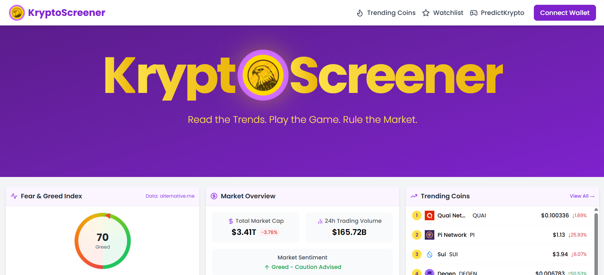
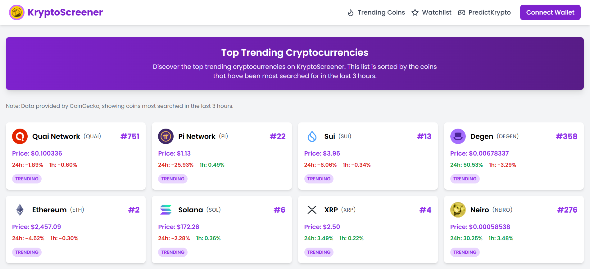
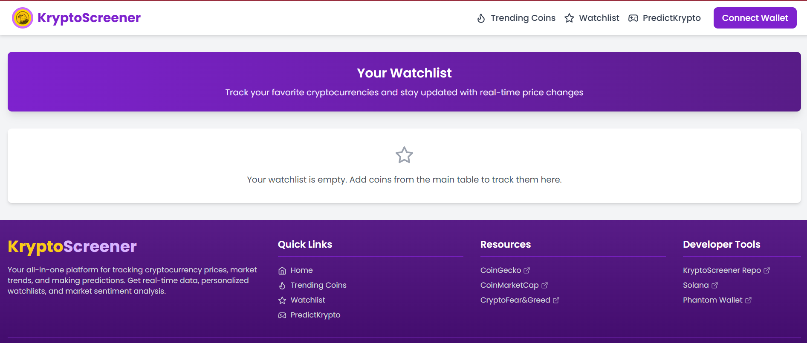

# 🚀 KryptoScreener

**KryptoScreener** is a powerful, interactive crypto market dashboard that not only tracks prices but also lets users test their intuition with a fun price prediction game. With real-time data, personalized watchlists, and a Solana wallet-based experience, this app is your gateway to understanding and navigating the volatile world of crypto.

🌐 Live Link : [kryptoscreener.vercel.app](https://kryptoscreener.vercel.app/)

---

## 📌 Features

- 🔄 **Live Market Data** via CoinGecko & Binance WebSocket
- 📊 **Trending Coins** — Discover top coins searched in the last 3 hours
- ⭐ **Personal Watchlist** — Stored securely in local storage
- 🎮 **PredictKrypto Game** — Predict short-term market movement using live data (Wallet-gated)
- 🔐 **Solana Phantom Wallet Integration** — Connect your wallet to play and track stats
- 🧠 **Fear & Greed Index** — Sentiment indicator from alternative.me
- 🌐 **Currency Conversion** — View coin prices in local fiat
- 🔍 **Search Functionality** — Find and track over 1,000+ cryptocurrencies
- 📱 **Mobile Responsive UI**
- 📈 **TradingView Widgets & Recharts** — Beautiful and informative charting

---

## 🛠️ Tech Stack

### Frontend
- **React.js** - For building the user interface.
- **Tailwind CSS** - For responsive, utility-first CSS styling.
- **Redux** - For managing the state of the application.
- **LocalStorage** - For saving the user's watchlist and game data locally.

### Realtime Data
- **CoinGecko API** - Provides real-time cryptocurrency market data.
- **Binance WebSocket** - Real-time updates on cryptocurrency price changes.

### Analytics / Charts
- **TradingView Widgets** - For embedding live market charts.
- **Recharts.js** - For creating beautiful charts and data visualizations.
- **Fear & Greed Index API** - Displays market sentiment based on current data.

### Backend (Minimal)
- **Node.js** - For backend logic and handling requests.

### Deployment
- **Vercel** - For hosting and deploying the application.


---

## 🌍 Pages Overview

### 🏠 Home Page


- Welcome message and project tagline:  
  *"Read the Trends. Play the Game. Rule the Market."*
- Market overview: market cap, trading volume
- Fear & Greed Index with current value
- Trending Coins list (Top 5)
- Real-time table of all cryptocurrencies
- Search bar + fiat currency toggle 

---

### 📈 Trending Page


- Shows top-trending cryptocurrencies (based on recent user interest)
- Updated every few hours via CoinGecko stats
- Clean tabular display with market data for each coin

---

### ⭐ Watchlist Page


- Custom watchlist saved in browser using LocalStorage
- Real-time updates on selected coins
- Quick remove/add functionality

---

### 🎮 PredictKrypto - Price Prediction Game

**Before Wallet Connect**  
 

**After Wallet Connected**  


- Connect Solana Phantom Wallet to unlock game
- Select coin (BTC, ETH, SOL, BNB, MATIC)
- Choose prediction interval (1, 3, 5, 10 minutes)
- Live chart from TradingView
- Make UP/DOWN prediction and see results
- Tracks your total wins/losses (stats saved post wallet auth)

**⚠️ Note:**  
Gameplay is **not available** unless the Phantom wallet is successfully connected.

---

## 📦 Installation

To get started with KryptoScreener locally, follow these steps:

1. **Clone the repository:**
   ```bash
   git clone https://github.com/sahilg28/KryptoScreener.git
   ```

2. **Navigate to the project directory:**
   ```bash
   cd KryptoScreener
   ```

3. **Install dependencies:**
   ```bash
   npm install
   ```

4. **Start the development server:**
   ```bash
   npm run dev
   ```

---

## ⭐ Give Us a Star!

If you find **KryptoScreener** helpful, please consider giving us a ⭐ on [GitHub](https://github.com/sahilg28/KryptoScreener).  
Your support means a lot and motivates us to keep building!

---

## 🤝 Contributing

Contributions are welcome! Feel free to fork the repo, open issues, or submit a pull request.

1. Fork the repository
2. Create your feature branch (`git checkout -b feature/AmazingFeature`)
3. Commit your changes (`git commit -m 'Add some AmazingFeature'`)
4. Push to the branch (`git push origin feature/AmazingFeature`)
5. Open a Pull Request

Make sure your code adheres to the project's coding standards and is well-tested.

---

## 🛡️ License

This project is licensed under **All Rights Reserved © 2025 Sahil Gupta**.  
You may not use, copy, modify, or distribute this code without explicit permission.

